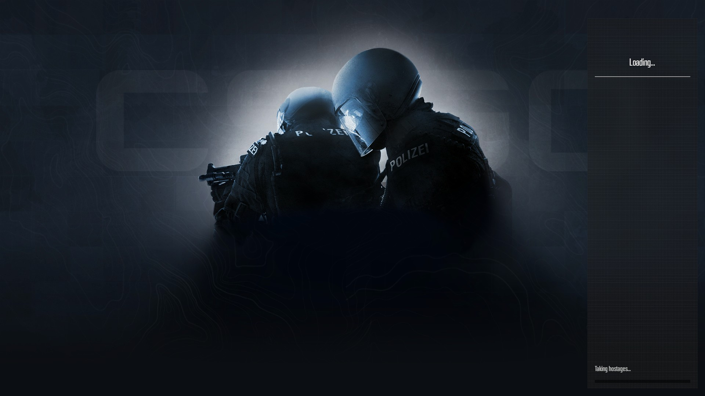
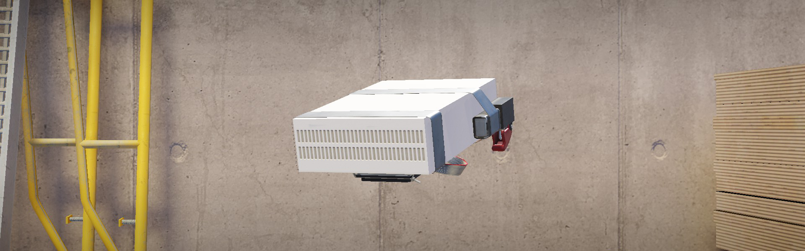
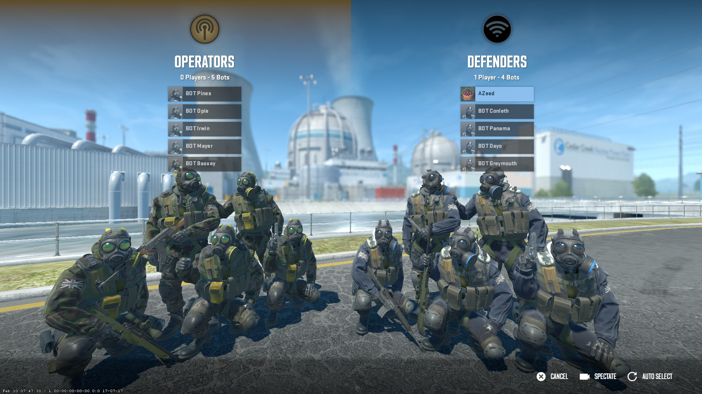
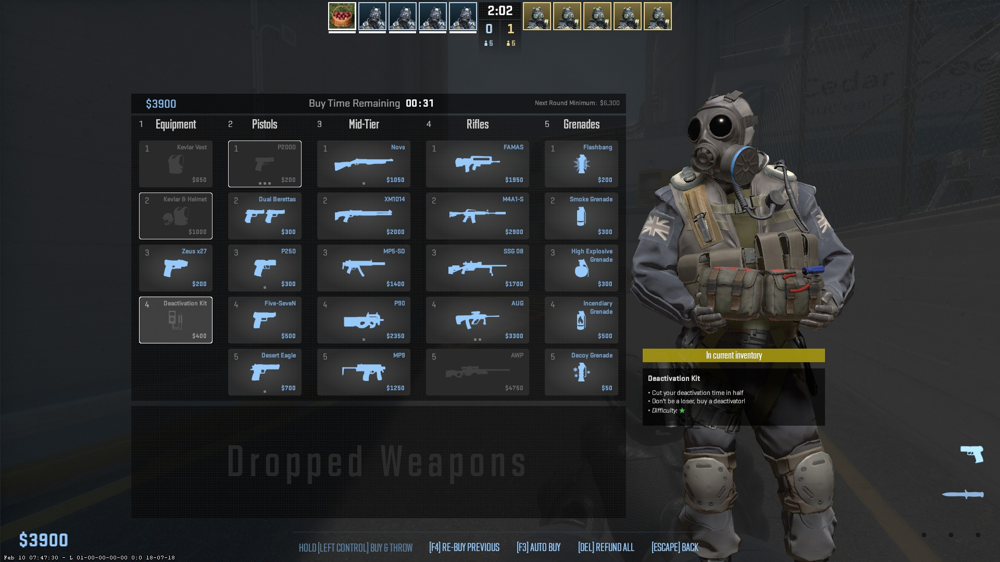
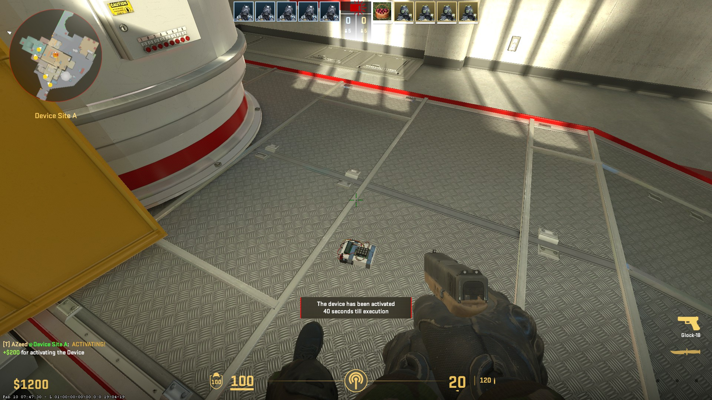

# CS2 Friendly Mod

This mod aims to remove all terrorism and reduce violence

## Features

- Replaces default terrorists with counter-terrorists
- Modifies terrorists with counter-terrorists text (English-only)
- Modifies C4 model, icons, sounds and text (English-only) to become a generic device used to hack/intercept/etc. servers
- Modifies defuser icons and text
- Replaces default loading screen

## Todo

- [ ] Hostage mode
- [ ] Remove blood decals
- [ ] Disable C4 explosion (MetaMod server plugin)

## Instructions

1. Install [VPKEdit](https://github.com/craftablescience/VPKEdit/blob/main/INSTALL.md)
1. (Windows) Download 64-bit [BusyBox](https://frippery.org/busybox) ([direct link](https://frippery.org/files/busybox/busybox64.exe)) and move it to `{CS2 installation folder}\game\csgo`
1. Download repository
1. Move `friendly` folder and `cs2friendly` scripts to `{CS2 installation folder}\game\csgo`
1. Use `cs2friendly.bat` (Windows) or `cs2friendly.sh` (Linux) to run the game, which automatically installs the mod if not installed or if game has updated and then launches the game using Steam

> [!TIP]
> `cs2friendly.bat` is only a wrapper script that executes `cs2friendly.sh` using BusyBox for Windows users

> [!NOTE]
> - Script makes backups of `pak01_dir.vpk`, `gameinfo.gi`, `game/bin/win64/vpk.signatures` (as `{filename}.bak`) before installing
> - You can't join matchmaking or any secure servers, but joining secure community servers with `sv_pure 0` should be possible but not in current CS2 update

## Attribution

All decompilation of Valve assets done using [Source 2 Viewer](https://s2v.app/)

### Mod Assets

| Asset | License/Source |
|-------|----------------|
|`characters/models/tm_phoenix/tm_phoenix.vmdl_c`|`pak01.vpk:characters/models/tm_phoenix/ctm_sas_variantf.vmdl_c`|
|`phase2/characters/models/tm_phoenix/tm_phoenix.vmdl_c`|`pak01.vpk:phase2/characters/models/tm_phoenix/ctm_sas_variantf.vmdl_c`|
|`panorama/images/econ/characters/customplayer_tm_phoenix_square_png.vtex_c"`|`pak01.vpk:panorama/images/econ/characters/customplayer_ctm_sas_variantf_square_png.vtex_c`|
|`sounds/weapons/c4/c4_beep{2\|3}.vsnd_c`|`pak01.vpk:sounds/ambient/common/energy/electrical_hum_2.vsnd_c`|
|`sounds/weapons/c4/c4_beep{2\|3}_10sec.vsnd_c`|`pak01.vpk:sounds/ambient/common/energy/fluorescent_hum_1.vsnd_c`|
|`panorama/images/map_icons/screenshots/1080p/default_psd.png`|`pak01.vpk:panorama/images/map_icons/screenshots/1080p/random_png.vtex_c`|
|Others|Assets representing nothing<ul><li>`pak01.vpk:models/props_doors/null.vmdl_c`<li>`pak01.vpk:sounds/common/null.vsnd_c`<li>`pak01.vpk:materials/models/props_doors/testnull.vmat_c`|

### Development Assets

| Asset | License/Source |
|-------|----------------|
|`assets/broadcast.svg`|`pak01.vpk:panorama/images/icons/ui/broadcast.vsvg_c`|
|`assets/wifi-1020-svgrepo-com.svg`|Public Domain|
|`assets/multimeter-multimeter-svgrepo-com.svg`|CC0|
